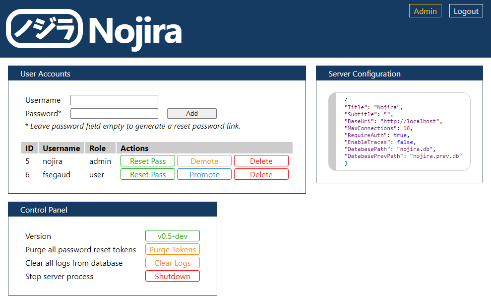

# Nojira (ノジラ)

[](https://github.com/fsegaud/nojira/actions/workflows/code.yml)
[](https://github.com/fsegaud/nojira/actions/workflows/build.yml)
[](https://github.com/fsegaud/nojira/releases)

Nojira is a software suite that allows remote logging.

It relies on .NET 4.6.1, and includes packages _NancyFX_, _SQLite-net_, _Newtonsoft.Json_ and their respective dependences.

## Nojira.Server

This is the process that will serve API request and web interface requests.

Log data are stored in a local SQLite database.

### Configuration

Configuration can be done by editing the _config.json_ file.

```json
{
  "Title": "Nojira",
  "Subtitle": "",
  "BaseUri": "http://localhost",
  "MaxConnections": 16,
  "RequireAuth": true,
  "EnableTraces": false,
  "DatabasePath": "nojira.db",
  "DatabasePrevPath": "nojira.prev.db"
}
```

### Database

Tables are automatically created if the database is empty. More info in _Database.cs_.

### API

```
<BaseUri>/log/{machine}/{type}/{project}/{tag}/{message*}
```

### Web interface

The web interface is accessible at `BaseUri` (by default: http://localhost/, a default user will automatically bre created).




#### Query

The web interface offer the possibility to query logs based on specific conditions. 

```
key=value0[,value1,...][;key=value0[,value1,...];...]
```

Here is an example :

```
project=nojira; tag=client,test; type=info,warning,error
```

## Nojira.Client

This is the C# client that send the HTTP requests.

```csharp
// Setup.
NojiraClient.Uri = "http://localhost:80";
NojiraClient.Project = "nojira";

// Logs.
NojiraClient.LogInfo("test", "test of an info message.");
NojiraClient.LogWarning("test", "test of an warning message.");
NojiraClient.LogError("test", "test of an error message.");
```

## Nojira.Test

A simple test program that makes use of the `Nojira.Client` to send request to the `Nojira.Server`.
