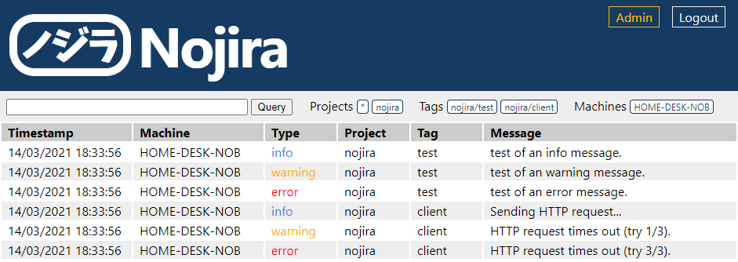

Nojira (ノジラ) is a softawre suite that allows remote logging.

It relies on .NET 4.6.1, and includes packages _NancyFX_, _SQLite-net_, _Newtonsoft.Json_ and thei respective dependences.



# nojira-daemon
This is the process that will serve API request and web interface requests.

Log data are stored in a local SQLite database.

## Configuration
Configuration can be done by editing the _config.json_ file.
```json
{
  "Title": "fsegaud/nojira",
  "BaseUri": "http://localhost:1410",
  "MaxConnections": 16,
  "DatabasePath": "logs.db",
  "DatabasePrevPath": "logs-prev.db"
}
```

## Database
Tables are automatically created if the database is empty.
```sql
CREATE TABLE "Log" (
"Id" integer primary key autoincrement not null ,
"Timestamp" bigint ,
"Type" varchar(16) ,
"Project" varchar(16) ,
"Tag" varchar(64) ,
"Message" varchar(256) )
```

# nojira-client
This is the C# client that send the HTTP requests.
```csharp
// Setup.
Nojira.Client.RemoteLog.Uri = "http://localhost:1410";
Nojira.Client.RemoteLog.Project = "nojira";

// Logs.
Nojira.Client.RemoteLog.LogInfo("test", "test of an info message.");
Nojira.Client.RemoteLog.LogWarning("test", "test of an warning message.");
Nojira.Client.RemoteLog.LogError("test", "test of an error message.");
```

# nojira-test
A simple test program that makes use of the `nojira-client` to send request to the `nojira-daemon`.